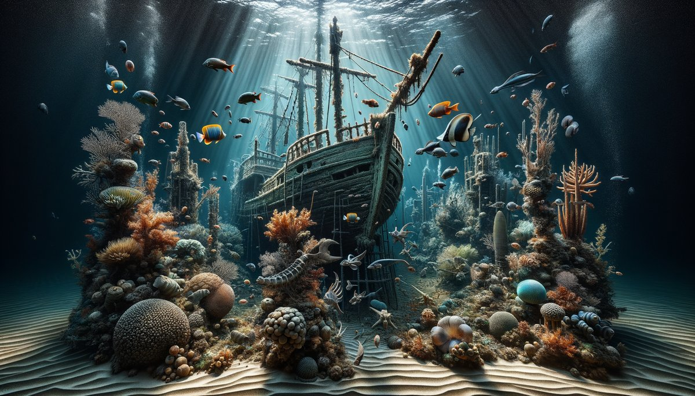

# 🧩 Tessellate-AI

<p align="center">
  
</p>

[](https://www.python.org/downloads/)
[](https://nextjs.org/)
[](https://openai.com/)
[](LICENSE)
[](https://github.com/PatrickKalkman/tessellate-ai/pulls)

> A self-improving jigsaw puzzle generation system that combines AI agents to create, evaluate, and serve digital jigsaw puzzles.

<p align="center">
  
  
  
</p>

## 🌟 Overview

Tessellate-AI is an innovative puzzle generation system that demonstrates an agent-based architecture where specialized AI components work together to create engaging digital jigsaw puzzles. Each agent has a single responsibility in the puzzle creation pipeline, from generating images to cutting them into playable pieces.

### Key Highlights
- 🎨 **AI-Generated Artwork**: Uses DALL-E 3 to create unique, puzzle-optimized images
- 🔍 **Quality Assurance**: Computer vision algorithms evaluate "puzzleability"
- ✂️ **Smart Cutting**: Generates interlocking pieces with realistic jigsaw patterns
- 🎮 **Web-Based Play**: Interactive puzzle game with drag-and-drop mechanics
- 📊 **Self-Improving**: Collects telemetry to optimize future puzzle generation

## 🚀 Features

### Backend (Python CLI)
- **Automated puzzle generation pipeline**
- **Quality scoring system** using edge detection and color analysis
- **Multiple cutting styles**: Classic, geometric, and organic patterns
- **Batch processing** with progress tracking
- **Rich terminal UI** with real-time status updates
- **Configurable complexity levels**

### Frontend (React/Next.js)
- **Static site architecture** for optimal performance
- **Canvas-based rendering** using Konva.js
- **Lazy loading** of puzzle pieces
- **Drag-and-drop** puzzle assembly
- **Auto-save** progress to local storage
- **Responsive design** for desktop and tablet
- **Smooth animations** and visual feedback

## 🏗️ Architecture

The system consists of four specialized agents:

```
┌─────────────────┐     ┌──────────────────┐     ┌───────────────┐     ┌────────────────────┐
│ Prompt Artisan  │────▶│ Quality Guardian │────▶│ Digital Cutter│────▶│Experience Orchestra│
└─────────────────┘     └──────────────────┘     └───────────────┘     └────────────────────┘
       │                         │                        │                        │
       ▼                         ▼                        ▼                        ▼
  Image Prompts            Quality Scores           Puzzle Pieces           Interactive Game
```

### Agent Responsibilities

1. **🎨 Prompt Artisan**
   - Generates optimized prompts for puzzle-worthy images
   - Considers visual complexity, color distribution, and edge patterns
   - Adapts based on quality feedback

2. **🔍 Quality Guardian**
   - Evaluates images using computer vision metrics
   - Scores based on edge density, color entropy, and local contrast
   - Rejects images below quality threshold (30/100)

3. **✂️ Digital Cutter**
   - Slices approved images into interlocking pieces
   - Supports multiple cutting patterns
   - Generates transparent PNGs with precise boundaries

4. **🎮 Experience Orchestrator**
   - Manages the frontend puzzle game
   - Handles piece interactions and placement logic
   - Collects gameplay telemetry for system improvement

## 📋 Prerequisites

- Python 3.8 or higher
- Node.js 18.x or higher
- OpenAI API key (for DALL-E 3 access)
- 4GB RAM minimum
- Modern web browser (Chrome, Firefox, Safari, Edge)

## 🛠️ Installation

### Backend Setup

1. **Clone the repository**
   ```bash
   git clone https://github.com/PatrickKalkman/tessellate-ai.git
   cd tessellate-ai
   ```

2. **Create and activate virtual environment**
   ```bash
   cd backend
   python -m venv venv
   source venv/bin/activate  # On Windows: venv\Scripts\activate
   ```

3. **Install dependencies**
   ```bash
   pip install -r requirements.txt
   ```

4. **Configure environment**
   ```bash
   cp .env.example .env
   # Edit .env and add your OpenAI API key
   ```

### Frontend Setup

1. **Navigate to frontend directory**
   ```bash
   cd frontend
   ```

2. **Install dependencies**
   ```bash
   npm install
   ```

3. **Run development server**
   ```bash
   npm run dev
   ```

## 🎮 Usage

### Generating Puzzles

Run the puzzle generation pipeline from the project root:

```bash
# Generate 20 puzzles with default settings
python -m backend --count 20

# Generate 10 high-complexity puzzles
python -m backend --count 10 --complexity 0.8

# Use geometric cutting style
python -m backend --style geometric

# Enable debug mode for detailed output
python -m backend --debug

# Custom output directory
python -m backend --output /path/to/puzzles
```

### Command Line Options

| Option | Description | Default |
|--------|-------------|---------|
| `--count` | Number of puzzles to generate | 10 |
| `--complexity` | Puzzle complexity (0.0-1.0) | 0.5 |
| `--style` | Cutting style (classic/geometric/organic) | classic |
| `--output` | Output directory for puzzles | ./public/puzzles |
| `--debug` | Enable debug logging | False |

### Playing Puzzles

1. Ensure puzzles are generated in `frontend/public/puzzles/`
2. Start the development server: `npm run dev`
3. Open http://localhost:3000 in your browser
4. Select a puzzle from the gallery
5. Drag pieces from the tray to assemble the puzzle

## 🎯 Quality Metrics

The Quality Guardian evaluates images based on three key metrics:

### 1. Edge Density (40% weight)
- Uses Canny edge detection
- Measures visual detail and boundaries
- Formula: `edge_pixels / total_pixels`

### 2. Color Entropy (35% weight)
- Calculates Shannon entropy over HSV histogram
- Measures color diversity and distribution
- Uses 32 bins per channel

### 3. Local Contrast (25% weight)
- Computes standard deviation of Sobel gradients
- Measures texture and detail variation
- Normalized to 0-1 range

### Quality Thresholds
- **Excellent**: 70+ (rich details, varied colors)
- **Good**: 50-69 (suitable for most players)
- **Acceptable**: 30-49 (minimum viable puzzle)
- **Rejected**: <30 (too simple or uniform)

## 📁 Project Structure

```
tessellate-ai/
├── backend/
│   ├── __init__.py
│   ├── __main__.py
│   ├── agents/
│   │   ├── prompt_artisan.py
│   │   ├── quality_guardian.py
│   │   ├── digital_cutter.py
│   │   └── experience_orchestrator.py
│   ├── models/
│   │   └── puzzle.py
│   ├── utils/
│   │   ├── image_utils.py
│   │   └── file_utils.py
│   └── tests/
├── frontend/
│   ├── app/
│   ├── components/
│   │   ├── PuzzleBoard.tsx
│   │   ├── PuzzleCanvas.tsx
│   │   └── KonvaLoader.tsx
│   ├── public/
│   │   └── puzzles/        # Generated puzzles
│   └── types/
├── docs/
├── .env.example
├── requirements.txt
├── package.json
└── README.md
```

## 🔧 Configuration

### Backend Configuration (.env)

```env
# OpenAI API Configuration
OPENAI_API_KEY=your-api-key-here

# Generation Settings
DEFAULT_PUZZLE_COUNT=10
DEFAULT_COMPLEXITY=0.5
DEFAULT_STYLE=classic

# Quality Thresholds
MIN_QUALITY_SCORE=30
TARGET_QUALITY_SCORE=50

# Output Settings
OUTPUT_DIR=./public/puzzles
IMAGE_FORMAT=jpg
PIECE_FORMAT=png
```

### Frontend Configuration

Configure in `frontend/next.config.js`:
- Asset paths
- Build settings
- Canvas configuration

## 🧪 Testing

### Backend Tests
```bash
cd backend
pytest tests/ -v
pytest tests/ --cov=backend --cov-report=html
```

### Frontend Tests
```bash
cd frontend
npm test
```

## 🚢 Deployment

### Deploy Frontend to Vercel

1. Push your code to GitHub
2. Connect your repository to Vercel
3. Configure build settings:
   - Build Command: `npm run build`
   - Output Directory: `out`
4. Deploy!

### Deploy Backend as API

The backend can be deployed as a microservice:
1. Containerize with Docker
2. Deploy to Cloud Run, AWS Lambda, or similar
3. Set environment variables
4. Configure CORS for frontend access

## 🛡️ Security

- **API Keys**: Never commit API keys to version control
- **CORS**: Configure appropriate CORS headers for production
- **Rate Limiting**: Implement rate limiting for API endpoints
- **Input Validation**: All user inputs are sanitized
- **Asset Security**: Generated puzzles use signed URLs in production

## 🐛 Troubleshooting

### Common Issues

**Canvas module error during build**
```bash
npm install --save-optional canvas@2.11.2
```

**OpenAI API errors**
- Verify API key in .env file
- Check API rate limits
- Ensure billing is active

**Puzzle pieces not loading**
- Check puzzle generation completed
- Verify file paths in manifest.json
- Clear browser cache

## 🤝 Contributing

We welcome contributions! Please see our [Contributing Guide](CONTRIBUTING.md) for details.

1. Fork the repository
2. Create your feature branch (`git checkout -b feature/AmazingFeature`)
3. Commit your changes (`git commit -m 'Add some AmazingFeature'`)
4. Push to the branch (`git push origin feature/AmazingFeature`)
5. Open a Pull Request

## 📈 Future Enhancements

- [ ] Multiple puzzle sizes (100, 500, 1000 pieces)
- [ ] Piece rotation feature
- [ ] Multiplayer collaboration
- [ ] Custom image upload
- [ ] Mobile app versions
- [ ] AI difficulty adjustment
- [ ] Themed puzzle collections
- [ ] Time-based challenges
- [ ] Social sharing features
- [ ] Achievement system

## 📄 License

This project is licensed under the MIT License - see the [LICENSE](LICENSE) file for details.

## 🙏 Acknowledgments

- OpenAI for DALL-E 3 API access
- Konva.js team for the excellent canvas library
- React and Next.js communities
- All contributors and testers

## 💬 Support

- **Issues**: [GitHub Issues](https://github.com/PatrickKalkman/tessellate-ai/issues)
- **Discussions**: [GitHub Discussions](https://github.com/PatrickKalkman/tessellate-ai/discussions)
- **Email**: patrick.kalkman@example.com
- **Twitter**: [@PatrickKalkman](https://twitter.com/PatrickKalkman)

---

<p align="center">
Made with ❤️ by Patrick Kalkman and the AI puzzle community
</p>

<p align="center">
  <a href="#-tessellate-ai">Back to top ⬆️</a>
</p>